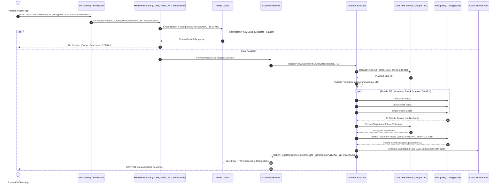

# Implementation Plan - Neocentra Customer Service (`neocentra-bank-be-cs` v1)

Dokumen ini berisi struktur perencanaan komprehensif untuk mengimplementasikan microservice **Neocentra Customer Service Backend (`neocentra-bank-be-cs`)** sesuai spesifikasi pada [v1-prd.md](file:///Users/mac/neocentra-bank/neocentra-bank-be-cs/prd/v1-prd.md).

---

## 1. Ringkasan Proyek & Arsitektur

### 1.1 Spesifikasi Utama
* **Bahasa & Runtime**: Golang 1.22+
* **Framework HTTP**: Gin Framework (`github.com/gin-gonic/gin`)
* **Port Service**: `8085`
* **Database Primary**: PostgreSQL 18 (Driver: `jackc/pgx/v5` dengan `pgxpool`)
* **Cache & Idempotency**: Redis 7 (Driver: `github.com/redis/go-redis/v9`) pada Port `6379`
* **Arsitektur**: Clean Architecture / Hexagonal Architecture
* **Sistem Keamanan**: AES-256 Field-Level Encryption (FLE) via Google Tink (`github.com/tink-crypto/tink-go/v2`), Envelope Encryption dengan Local KMS, dan JWT HS256 Authentication
* **Validasi**: `github.com/go-playground/validator/v10`
* **Optimasi Concurrency**: Parallel DB Check via `golang.org/x/sync/errgroup` & Async Background Worker Pool via Buffered Channels

---

## 2. Diagram Alur & Interaksi Komponen



---

## 3. Rencana Implementasi Tahap demi Tahap (Roadmap)

### Tahap 1: Setup Fondasi Infrastruktur & Konfigurasi Baseline
Memastikan koneksi database, cache, dan konfigurasi lingkungan berjalan secara efisien dan aman.

* [ ] **1.1 Inisialisasi Environment Loader** (`internal/config/config.go`)
  * Memuat variabel `.env`: `PORT` (8085), `JWT_SECRET`, `LOCAL_KMS_MASTER_KEY`, `DATABASE_URL`, dan `REDIS_URL`.
  * Menyediakan struct konfigurasi aman terpusat untuk aplikasi.
* [ ] **1.2 Inisialisasi PostgreSQL Connection Pool** (`pkg/database/postgres.go`)
  * Menggunakan `jackc/pgx/v5/pgxpool`.
  * Konfigurasi `MaxConns`, `MinConns`, `MaxConnLifetime`, dan `MaxConnIdleTime`.
  * Memastikan koneksi mendukung prepared statements & ACID Transaction.
* [ ] **1.3 Inisialisasi Redis Client** (`pkg/database/redis.go`)
  * Menggunakan `github.com/redis/go-redis/v9`.
  * Menyiapkan fungsi ping healthcheck koneksi ke Redis `localhost:6379`.

---

### Tahap 2: Domain Layer & Repository Layer (Data Access)
Membangun entitas domain utama dan akses data PostgreSQL dengan Hexagonal Architecture.

* [ ] **2.1 Entitas Domain & Custom Errors** (`internal/domain/customer.go`, `internal/domain/kms.go`, `internal/domain/errors.go`)
  * Struct `Customer` (`customer_id`, `nik`, `full_name`, `email`, `phone_number`, `address`, `status`, `created_at`, `updated_at`).
  * Struct `KMSSetting` / `KMSRepository` interface.
  * Definisi error domain standar (e.g. `ErrDuplicateNIK`, `ErrDuplicateEmail`, `ErrDuplicatePhone`, `ErrInvalidDecryption`).
* [ ] **2.2 Implementasi Repository KMS PostgreSQL** (`internal/repository/postgres/kms_repo.go`)
  * Mengimplementasikan interface `usecase.KMSRepository`.
  * Fungsi `GetKeysetByName`: Membaca `encrypted_keyset` dari tabel `kms_keysets`.
  * Fungsi `SaveKeyset` & `UpdateKeyset`: Menyimpan dan mengupdate version & primary key ID.
* [ ] **2.3 Implementasi Repository Customer PostgreSQL** (`internal/repository/postgres/customer_repo.go`)
  * Interface `CustomerRepository` (`CreateCustomer`, `ExistsByNIK`, `ExistsByEmail`, `ExistsByPhone`).
  * Implementasi query efisien dengan `pgxpool` dan Prepared Statements.

---

### Tahap 3: Integrasi Security System (Local KMS & Tink AEAD)
Menghubungkan manajemen enkripsi PII dan Goroutine background scheduler untuk rotasi kunci zero-downtime.

* [ ] **3.1 Verifikasi & Pengujian Local KMS Service** (`internal/usecase/kms_encryptor.go`)
  * Menggunakan SDK `github.com/tink-crypto/tink-go/v2/aead` dengan Primitive `AES256-GCM`.
  * Fungsi `EncryptPII(plaintext, aad)` dan `DecryptPII(ciphertext, aad)`.
  * Memastikan Envelope Encryption bekerja dengan Master Key (KEK) dari ENV `LOCAL_KMS_MASTER_KEY`.
* [ ] **3.2 Rotasi Kunci Otomatis (Background Worker)** (`internal/usecase/kms_encryptor.go`)
  * Mengaktifkan `StartRotationWorker` dengan `time.Ticker` interval 90 hari.
  * Menerapkan lock `sync.RWMutex` untuk menjamin zero-downtime saat rotasi key terjadi.

---

### Tahap 4: Core Business Logic & UseCase Layer
Mengimplementasikan alur registrasi nasabah terlindungi, validasi paralel, dan worker pool async.

* [ ] **4.1 Implementasi DTO Payload** (`internal/dto/register_request_dto.go`, `internal/dto/register_response_dto.go`)
  * `EncryptedRegisterCustomerRequest`: Menampung payload ciphertext dari frontend (`nik`, `full_name`, `email`, `phone_number`, `address`).
  * `PlaintextRegisterCustomer`: Menampung data terdekripsi dengan validator tags (`len=16`, `email`, `e164`, dll).
  * `RegisterCustomerAPIResponse` & `RegisterCustomerResponseData`: Sesuai kontrak DTO `register_cs_response.json`.
* [ ] **4.2 Worker Pool Task Asinkron** (`internal/usecase/worker_pool.go`)
  * Membuat Buffered Channel & Goroutine Worker Pool untuk memproses tugas non-core (pengiriman email notifikasi & pencatatan audit log).
  * Menerapkan Graceful Shutdown pada worker channel.
* [ ] **4.3 Implementasi Customer UseCase** (`internal/usecase/customer_usecase.go`)
  * **Langkah Dekripsi**: Mendekripsi payload request dari Frontend menggunakan `kms.DecryptPII`.
  * **Langkah Validasi Format**: Menjalankan `validator/v10` pada `PlaintextRegisterCustomer`.
  * **Langkah Validasi Unik Paralel (Fan-Out/Fan-In)**: Menggunakan `golang.org/x/sync/errgroup` untuk mengecek keberadaan NIK, Email, dan Phone secara bersamaan di DB.
  * **Langkah Enkripsi Data Simpanan**: Mengenkripsi ulang data sensitif dengan `kms.EncryptPII` sebelum ke DB.
  * **Langkah Simpan DB**: Memanggil `customerRepo.CreateCustomer` dengan status `PENDING_VERIFICATION`.
  * **Langkah Task Async**: Mengirim job ke Worker Pool tanpa menghentikan response utama (non-blocking).

---

### Tahap 5: Delivery HTTP Layer (Router, Middleware & Handler)
Menyiapkan endpoint HTTP REST API Gin dan middleware keamanan & optimasi.

* [ ] **5.1 Refinement Middlewares Standard** (`internal/delivery/http/middleware/middleware.go`)
  * `CORSMiddleware`: Header origin `*`, credentials, `OPTIONS` preflight.
  * `RecoveryMiddleware`: Catch panic, log stack trace internal, response 500 JSON.
  * `JWTAuthMiddleware`: Parse & validate HS256 JWT dari header `Authorization: Bearer <token>` menggunakan `JWT_SECRET`.
* [ ] **5.2 Implementasi Idempotency Middleware** (`internal/delivery/http/middleware/idempotency.go`)
  * Membaca header `X-Idempotency-Key`.
  * Eksekusi Redis `SETNX` (Key: `idempotency:<key>`, TTL: 10 Menit).
  * Mengembalikan cached HTTP response jika key sudah ada (0 DB Hit).
* [ ] **5.3 Update Customer Handler** (`internal/delivery/http/handler/customer_handler.go`)
  * Menyesuaikan `RegisterCustomer` agar terintegrasi penuh dengan `CustomerUseCase`.
  * Penanganan error JSON yang konsisten (`StatusBadRequest`, `StatusUnprocessableEntity`, `StatusInternalServerError`).
* [ ] **5.4 Router Setup & Healthcheck** (`internal/delivery/http/router.go`)
  * Endpoint `GET /health` (Public response `{"status":"UP","service":"neocentra-bank-be-cs"}`).
  * Endpoint `POST /api/v1/customers/register` (Terlindungi JWTAuthMiddleware & IdempotencyMiddleware).

---

### Tahap 6: Entrypoint Service & Dependency Injection
Menghubungkan seluruh komponen dalam `cmd/api/main.go`.

* [ ] **6.1 Inisialisasi Main Application** (`cmd/api/main.go`)
  * Load env, init PostgreSQL `pgxpool`, init Redis Client.
  * Init `KMSRepository`, `LocalKMSService` & Jalankan Rotation Worker background.
  * Init `CustomerRepository`, `WorkerPool`, `CustomerUseCase`.
  * Init `CustomerHandler` & Setup HTTP Router di port `8085`.
* [ ] **6.2 Handling Graceful Shutdown** (`cmd/api/main.go`)
  * Menangkap sinyal `SIGINT` / `SIGTERM`.
  * Menutup HTTP Server, Worker Pool channel, dan Pool Koneksi DB/Redis secara rapi.

---

## 4. Matriks Pemetaan File & Komponen

| Komponen Layer | File Path | Peran & Deskripsi | Status |
| :--- | :--- | :--- | :--- |
| **Config & Database** | [config.go](file:///Users/mac/neocentra-bank/neocentra-bank-be-cs/internal/config/config.go) | Memuat konfigurasi ENV terpusat | [ ] Draft |
| **Config & Database** | [postgres.go](file:///Users/mac/neocentra-bank/neocentra-bank-be-cs/pkg/database/postgres.go) | Inisialisasi Connection Pool `pgxpool` PostgreSQL 18 | [ ] Draft |
| **Config & Database** | [redis.go](file:///Users/mac/neocentra-bank/neocentra-bank-be-cs/pkg/database/redis.go) | Inisialisasi Redis Client v9 | [ ] Draft |
| **Domain Entity** | [customer.go](file:///Users/mac/neocentra-bank/neocentra-bank-be-cs/internal/domain/customer.go) | Struct Entitas Nasabah | [ ] Draft |
| **DTO** | [register_request_dto.go](file:///Users/mac/neocentra-bank/neocentra-bank-be-cs/internal/dto/register_request_dto.go) | Struct Payload Request (Encrypted Base64 & Plaintext) | [x] Existing |
| **DTO** | [register_response_dto.go](file:///Users/mac/neocentra-bank/neocentra-bank-be-cs/internal/dto/register_response_dto.go) | Struct Payload Response API Nasabah | [x] Existing |
| **Repository** | [kms_repo.go](file:///Users/mac/neocentra-bank/neocentra-bank-be-cs/internal/repository/postgres/kms_repo.go) | Access layer database tabel `kms_keysets` | [ ] Pending |
| **Repository** | [customer_repo.go](file:///Users/mac/neocentra-bank/neocentra-bank-be-cs/internal/repository/postgres/customer_repo.go) | CRUD & Cek Keunikan Nasabah di PostgreSQL | [ ] Pending |
| **UseCase (Security)** | [kms_encryptor.go](file:///Users/mac/neocentra-bank/neocentra-bank-be-cs/internal/usecase/kms_encryptor.go) | Enkripsi/Dekripsi Google Tink & Worker Rotasi Key | [x] Existing |
| **UseCase (Logic)** | [customer_usecase.go](file:///Users/mac/neocentra-bank/neocentra-bank-be-cs/internal/usecase/customer_usecase.go) | Core Business Logic, Validasi Paralel & Decrypt/Encrypt | [ ] Pending |
| **UseCase (Async)** | [worker_pool.go](file:///Users/mac/neocentra-bank/neocentra-bank-be-cs/internal/usecase/worker_pool.go) | Background Worker Pool untuk Audit Log & Email | [ ] Pending |
| **HTTP Middleware** | [middleware.go](file:///Users/mac/neocentra-bank/neocentra-bank-be-cs/internal/delivery/http/middleware/middleware.go) | CORS, Recovery, dan JWT Auth Middleware | [x] Existing |
| **HTTP Middleware** | [idempotency.go](file:///Users/mac/neocentra-bank/neocentra-bank-be-cs/internal/delivery/http/middleware/idempotency.go) | Idempotency Key SETNX Redis Middleware | [ ] Pending |
| **HTTP Handler** | [customer_handler.go](file:///Users/mac/neocentra-bank/neocentra-bank-be-cs/internal/delivery/http/handler/customer_handler.go) | Handler Endpoint `/api/v1/customers/register` | [x] Refactor |
| **HTTP Router** | [router.go](file:///Users/mac/neocentra-bank/neocentra-bank-be-cs/internal/delivery/http/router.go) | Engine Gin, Routing `/health` & Protected Group | [x] Existing |
| **Main Entrypoint** | [main.go](file:///Users/mac/neocentra-bank/neocentra-bank-be-cs/cmd/api/main.go) | Dependency Injection & Application Runner Port 8085 | [ ] Refactor |

---

## 5. Rencana Pengujian & Verifikasi (Verification Plan)

### 5.1 Automated Unit Tests
Jalankan pengujian unit pada fungsi kriptografi dan komponen logika:
```bash
# Test Unit Enkripsi KMS Google Tink
go test -v ./internal/usecase/kms_encryptor_test.go ./internal/usecase/kms_encryptor.go

# Test Seluruh Package
go test -v ./...
```

### 5.2 Manual Runtime Verification
1. **Menjalankan Application**:
   ```bash
   go run cmd/api/main.go
   ```
2. **Verifikasi Healthcheck Endpoint**:
   ```bash
   curl -i http://localhost:8085/health
   ```
   *Expected Response*: `HTTP 200 OK` dengan body `{"status":"UP","service":"neocentra-bank-be-cs"}`.

3. **Verifikasi Auth Middleware**:
   ```bash
   curl -i -X POST http://localhost:8085/api/v1/customers/register
   ```
   *Expected Response*: `HTTP 401 Unauthorized`.

4. **Verifikasi Endpoint Registration & Idempotency Key**:
   * Kirim request dengan JWT valid di header `Authorization: Bearer <token>` dan header `X-Idempotency-Key: <uuid>`.
   * Verifikasi ciphertext di-decrypt, divalidasi, disimpan di PostgreSQL (`status`: `PENDING_VERIFICATION`), dan mengembalikan response JSON sesuai `register_cs_response.json`.
   * Kirim request ulang dengan `X-Idempotency-Key` yang sama untuk memastikan Redis membalas respons dari cache tanpa query ulang ke PostgreSQL (0 DB Hit).
